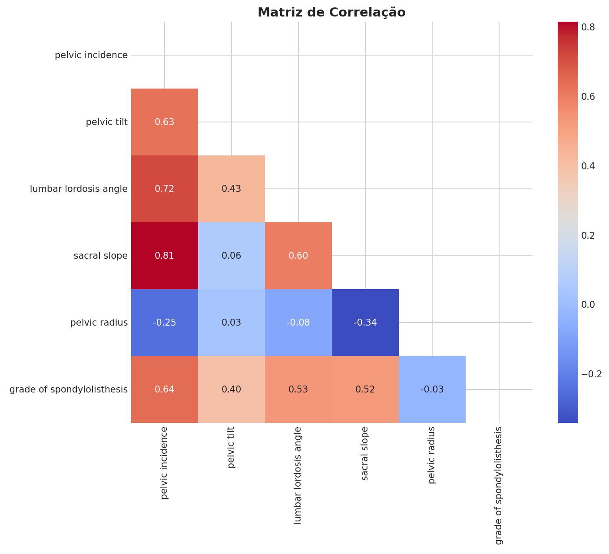

# Projeto NIAD: Análise Preditiva da Coluna Vertebral

## 📄 Descrição do Projeto
Este projeto integra o entregável final da Trilha de Aprendizado do **NIAD**. O objetivo foi consolidar um pipeline completo de Ciência de Dados: desde a análise exploratória e limpeza estatística até a exportação de um modelo preditivo capaz de classificar condições da coluna vertebral entre "Normal" e "Abnormal".

O projeto destaca-se pela interpretação clínica dos erros, priorizando a análise do custo humano e financeiro de diagnósticos incorretos (Falsos Negativos vs. Falsos Positivos).

## 🎯 Estratégia Técnica

### 1. Limpeza e Engenharia de Dados
* **Tratamento de Outliers (IQR):** Aplicamos a técnica de Amplitude Interquartil para remover ruídos e medições extremas, garantindo que o modelo aprenda com dados clinicamente consistentes.
* **Análise de Correlação:** Identificamos fortes relações entre variáveis como `pelvic_incidence` e `sacral_slope` (0.86).

### 2. Modelagem: Random Forest Classifier
* **Ensemble Learning:** O uso de 100 árvores de decisão permitiu uma classificação estável, evitando o overfitting.
* **Feature Importance:** O modelo permitiu identificar quais medidas biomecânicas são mais determinantes.

## 📈 Interpretação dos Resultados (Foco Clínico)
O modelo final foi testado em um conjunto de 56 pacientes:
* **Acurácia Geral:** ~84%
* **Verdadeiros Positivos:** 34 acertos.
* **Falsos Negativos (Risco):** 4 casos.
* **Falsos Positivos (Custo):** 5 casos.

## 📁 Estrutura do Repositório
* `S.ipynb`: Notebook principal com o pipeline completo.
* `Dataset_spine.csv`: Base de dados original.
* `modelo_coluna_vertebral.pkl`: Modelo exportado via `joblib`.
* `graficos_coluna/`: Visualizações geradas.

## 🛠️ Tecnologias
* **OS:** Arch Linux (Kernel 6.x) | **Python 3.13**
* **Libs:** Pandas, NumPy, Scikit-Learn, Seaborn e Matplotlib.